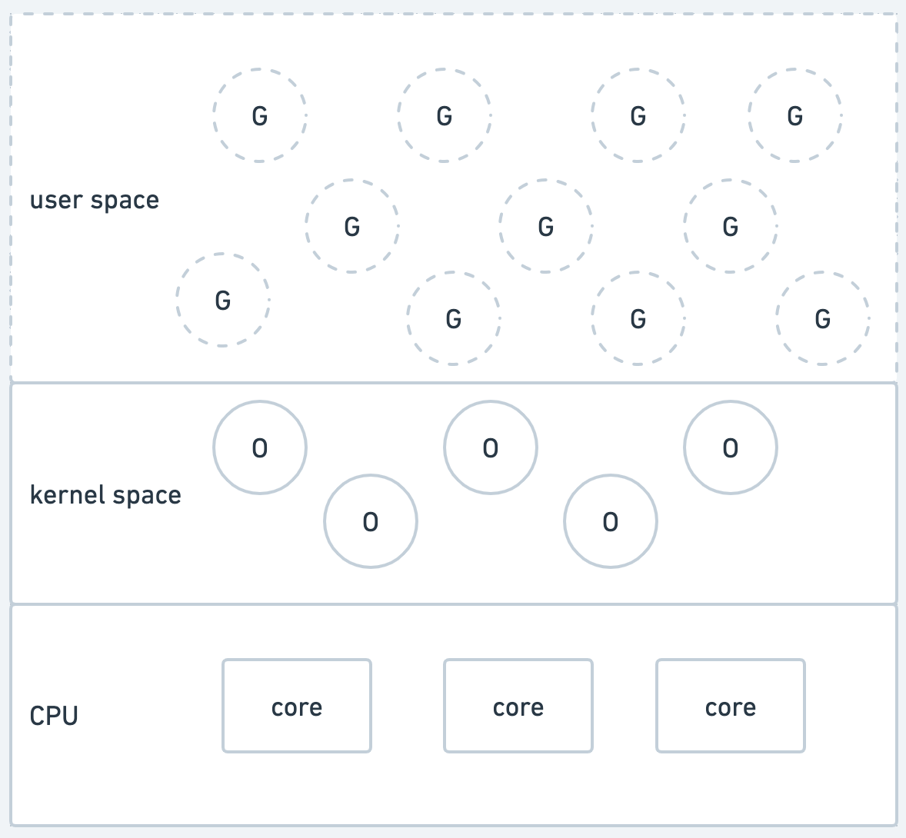

# Content

- [Goroutines](#goroutines)
  - [Why Concurrency Matters?](#why-concurrency-matters)
  - [Concurrency vs Parallelism](#concurrency-vs-parallelism)
  - [Concurrency in Go with Goroutines](#concurrency-in-go-with-goroutines)
- [Goroutine Internals](#goroutine-internals)
  - [Processes vs Threads vs Goroutines](#processes-vs-threads-vs-goroutines)
  - [Go Runtime](#go-runtime)
    - [Key Components of the Go Runtime](#key-components-of-the-go-runtime)
  - [Go Scheduler](#go-scheduler)
    - [Main Responsibilities of Go Scheduler](#main-responsibilities-of-go-scheduler)
  - [How Scheduling Works?](#how-scheduling-works)
  - [`M:N` Multiplexing in Go](#mn-multiplexing-in-go)
    - [Initialization: OS Threads and Logical Cores](#initialization-os-threads-and-logical-cores)
    - [Local Run Queues (LRQs)](#local-run-queues-lrqs)
    - [Global Run Queue (GRQ)](#global-run-queue-grq)
- [References](#references)

```
My Questions:

- Why running goroutines on go runtime is more efficient than OS?
- What does `runtime.GOMAXPROCS` do?
```

# Goroutines

## Why Concurrency Matters?

- **Traditional programs execute sequentially**, blocking subsequent instructions until the current one finishes.
- Sequential execution is simple and clear, but can be inefficient for long-running tasks.
- **Problem**: If one step (e.g., fetching data) takes time, the entire program stalls.
- This becomes a bottleneck in systems that need to handle multiple users or processes.
- **Concurrency enables switching between tasks**, making better use of CPU time during waiting periods (e.g., I/O).
- Concurrency is crucial for responsive systems, such as web servers handling many simultaneous requests.

## Concurrency vs Parallelism

| Concurrency                                                                                                                    | Parallelism                                         |
| ------------------------------------------------------------------------------------------------------------------------------ | --------------------------------------------------- |
| Multiple tasks are _in progress_ - i.e., managed or scheduled simultaneously (but not necessarily running at the same instant) | Multiple tasks are _executing_ at the same time     |
| Tasks may be interleaved on a **single CPU core**                                                                              | Tasks run on **different CPU cores** simultaneously |
| Focuses on _task switching_ and responsiveness                                                                                 | Focuses on _performance_ and throughput             |

- Go's concurrency model
  - Uses **goroutines** to structure concurrent programs easily.
  - On multi-core systems, Go can **run goroutines in parallel** using `runtime.GOMAXPROCS`
  - On a single core, Go uses **concurrency to avoid blocking**, improving efficiency.

## Concurrency in Go with Goroutines

- Goroutines are lightweight, concurrent functions in Go.
- Uses the `go` keyword to launch a function as a goroutine.
  - E.g., `go task("Task 1")` runs the `task` function concurrently.
- Goroutines are **managed by the Go runtime**, not the OS, making them more efficient than traditional threads.
- **Important**: If the `main()` function exits, goroutines may be terminated before completing
  - Use `sync.WaitGroup` to prevent this.

---

- Output from multiple goroutines is **interleaved**, showing concurrent execution.
- Example where "Task 1" and "Task 2" are running in overlapping order.
  - https://go.dev/play/p/M35jyHJmRGf

```sh
Output:
Task 2 running 0
Task 1 running 0
Task 1 running 1
Task 2 running 1
Task 2 running 2
Task 1 running 2
All tasks completed!
```

---

# Goroutine Internals

## Processes vs Threads vs Goroutines

- Processes and Threads
  - A **process** is a program in execution and can **spawn multiple threads**.
  - Threads are **OS-level entities**, managed by the OS.
  - Threads can create more threads, enabling a **multi-threaded environment**.
- Logical Processors
  - Each **logical processor** can execute **one thread at a time**.
  - A system with N logical processors can theoretically run N threads in parallel.
    - In reality, **context switching** allows a single processor to handle many threads efficiently, giving the illusion of more parallelism.
- Go's Approach to Concurrency
  - Goroutines are **lightweight threads of execution**.
  - Managed by the **Go runtime**, not the OS.
  - This leads to lower overhead and higher efficiency compared to traditional threads.

<p>
  
</p>

- **Goroutine**
  - Operates in the **user space**, offering a more efficient and manageable approach to concurrency.
  - Goroutines are like lightweight tasks managed by Go itself (not the OS). They run in the background efficiently and don't need much memory or setup.
    Think of them as "mini threads" that Go controls to keep things fast.
- **OS-Level Threads**
  - Reside in the **kernel space**, governed by the OS's scheduling and management mechanisms.
  - These are heavier threads managed by the OS. They need more resources and the OS decides when and there they run.
    They are more powerful but slower to start and switch between.
- **CPU Cores**
  - Underlying hardware layer, execute the threads or goroutines scheduled by the respective managing entities.
  - These are the actual physical parts of your computer that do the work. They run whatever the OS (or Go runtime) tells them to, whether it's a thread or a goroutine.
    Think of CPU cores as the workers, and threads/goroutines as tasks handed to them.

## Go Runtime

The Go runtime is like the **engine behind every Go program**. It manages hwo your code runs, so you don't have to worry about low-level system details.
It quietly handles memory, concurrency and scheduling in the background.

### Key Components of the Go Runtime

1. Garbage Collection

- Automatically frees memory that your program no longer needs.
- Helps prevent memory leaks and keeps your app running smoothly.

2. Goroutine Scheduler

- Manages the execution of goroutines.
- Decides which goroutine runs and when, ensuring efficient concurrent execution.

## Go Scheduler

The Go scheduler is a core part of the Go runtime that **controls when and where goroutines run**.
It makes Go'c concurrency powerful and efficient.

### Main Responsibilities of Go Scheduler

1. Managing Goroutines

- Decides which goroutines run and when.
  - E.g., It's like a conductor ensuring each musician (goroutine) plays at the right moment in an orchestra.

2. `M:N` Multiplexing (Many-to-Few)

- Maps **many goroutines to fewer OS threads**.
- This is why goroutines are lightweight, you can run thousands without high memory cost.

3. Cooperative Scheduling (Traditional Behavior)

- Goroutines **voluntarily yield** control at certain points (e.g., I/O, `time.Sleep`)
  - This means that Goroutines pause themselves at certain moments to give other goroutines a chance to run.
    The Go scheduler doesn't forcefully interrupt them (at least, not in older versions), Instead, the
    goroutine reaches a natural stopping point where it tells the scheduler: "I'm doing something that takes time (like I/O), so go ahead and let others run while I wait."
- Keeps context switching fast and predictable, with less overhead.

4. Preemptive Scheduling (Newer Go Versions)

- If a goroutine runs too long, the scheduler can **force it to yield**.
- Prevents any single goroutine from **hogging the CPU**.
- Achieved by checking for preemption at safe points during execution (e.g., loop back-edges)
  - Go can't just pause any goroutine at any random instruction, that would be unsafe and message.
    Instead, Go picks specific, safe moments in the execution to check if a goroutine should be stopped and swapped out.

## How Scheduling Works?

A key aspect of Go's scheduling mechanism is its interaction with the logical cores of your system. Here's how it works:

1. Launching OS Threads

- When you start a Go program, the runtime initiates a number of OS threads that is equal to the number of logical processors available.
- These OS threads are managed by the OS. This management includes tasks like creating the threads, blocking them and handling their waiting states.

<p>
  
</p>

2. Logical Processors

- `Logical Cores = (Number of Physical Cores) * (Number of hardware threads that can run on each core)`
  - _Hardware Thread_: aka simultaneous multithreading (SMT) or logical threads, refer to the ability of a single physical CPU core
    to execute multiple threads of execution concurrently.

<p>
  
</p>

- For example, on mac, there are 8 physical cores. It can run 2 hardware threads per core. So there are a total of 16 logical cores.

3. Determine the Number of Logical Processors in Go

- Use `runtime.NumCPU()` in Go to find the number of logical processors on your system.
- The problem below tells you how many logical processors (or threads) your Go program can potentially run concurrently.

```go
func main() {
    fmt.Println("Number of CPUs:", runtime.NumCPU())
}

// Output:
// Number of CPUs: 16
// This indicates that I have 16 logical processors available, meaning 2 hardware threads can run on each physical processor.
```

## `M:N` Multiplexing in Go

- Go uses an `M:N` scheduling model, where M goroutines are **multiplexed** onto N OS threads.
- This allows thousands (or even millions) of lightweight goroutines to run on a limited number of OS threads efficiently.

<p align="center">
  
</p>

### Initialization: OS Threads and Logical Cores

- When a Go program starts, the **Go runtime creates OS threads equal to the number of logical CPU cores** (`GOMAXPROCS`).
- Each OS thread is paired with a **Processor (P)**, which manages execution and scheduling.
- Each **P maintains a Local Run Queue (LRQ)**, storing goroutines ready to run.

### Local Run Queues (LRQs)

- Introduced to decentralize goroutine scheduling and reduce contention from a single queue.
- Each LRQ holds goroutines specific to its associated P, allowing parallel scheduling.
- Helps in maintaining synchronization overhead and improves scalability.

### Global Run Queue (GRQ)

- Holds goroutines that are ready but not yet assigned to a specific LRQ.
- Acts as a central pool when LRQs are empty or need work stealing.
  - _Work Stealing_: If a P's LRQ is empty, it may steal goroutines from another P's LRQ or from the GRQ. This ensures load balancing and prevents idling.
- Periodically scanned by the Go scheduler, which redistributes goroutines to balance load.

## Parking and Unparking OS Threads in Go

### The Art of Parking

- Go parks idle OS threads instead of terminating them.
- Parking puts threads in a sleep state with minimal resource usage.
- Threads are effectively "waiting in the green room", ready to resume work.

### Why Parking Matters

- Creating/destroying OS threads is expensive (in CPU and memory).
- Parking avoids this overhead, leading to better resource efficiency.
- Maintains a **pool of reusable threads** to improve system responsiveness.

### The Unparking Cue

- When work (goroutines) is available, parked threads are unparked.
- Unparking wakes the thread, restores its state, and assigns it new goroutines.
- Enables fast task execution with minimal delay.

### Optimization and Responsiveness

- Reduces latency by avoiding thread creation delays.
- Threads are always in a near-ready state.
- Contributes to Go's lightweight, scalable concurrency model.

## Work Stealing

- When an OS thread's Local Run Queue (LRQ) is empty, it tries to "steal" goroutines from:
  - Other threads' LRQs or
  - The Global Run Queue (GRQ)
- Why It Matters
  - Prevents threads from going idle when there's still work to be done.
  - Ensures efficient CPU usage and load balancing across threads.
  - Reduces the chance of bottlenecks by dynamically redistributing work.
- How It Works
  - Threads constantly check their LRQ for goroutines.
  - If empty, they **probe peer queues** or fallback to the GRQ.
  - This keeps threads productive without centralized scheduling overhead.

## Goroutine States

<p align="center">
  
</p>

- 🟡 Runnable (Ready but Waiting)
  - Goroutine is queued and ready for execution.
  - Awaiting assignment to an OS thread.
- 🟢 Running (Actively Performing)
  - Goroutine is executing on an OS thread
  - Actively consuming CPU time.
- 🔴 Blocked (Waiting on Events)
  - Goroutine is paused, waiting for I/O, network, channel, mutex, etc.
  - Not using CPU during this time.
- ⚫ Dead (Execution Completed)
  - Goroutine has finished its execution.
  - No longer part of the scheduling or runtime system.

## Syscalls and I/O: Deepening the Goroutine Lifecycle

- Blocked State due to Syscalls and I/O
  - Goroutines enter the `Blocked` state when performing syscalls or I/O operations.
  - These actions involve **waiting for external events** (e.g., disk reads, network reply).
  - While blocked, goroutines release the CPU, they do not consume CPU time.
- Efficient Scheduling During Blocking
  - Go's scheduler detects when a goroutine blocks on a syscall.
  - The **underlying OS thread is reused**: another **runnable goroutine is scheduled** on it.
    - Go scheduler brings in a new thread from its pool (or creates one if needed), this ensures Go's runtime always has threads available to run other goroutines.
    - Another goroutine (in Runnable state) is scheduled on that new thread, so CPU time isn't wasted, Go reuses system resources efficiently.
  - This avoids CPU idling and maintains high concurrency and responsiveness.
- Key Optimization Insight
  - Go separates the concerns of logical concurrency (goroutines) and physical concurrency (OS threads)
  - By dynamically reallocating threads to runnable goroutines, blocking operations don't stall progress.
  - Enables Go to scale thousands (or millions) of goroutines efficiently.

# References

- [Goroutines in Go: A Practical Guide to Concurrency](https://getstream.io/blog/goroutines-go-concurrency-guide/)
- [Goroutines under the hood](https://vitalcs.substack.com/p/goroutines-under-the-hood)
- [Go Scheduler](https://nghiant3223.github.io/2025/04/15/go-scheduler.html)
