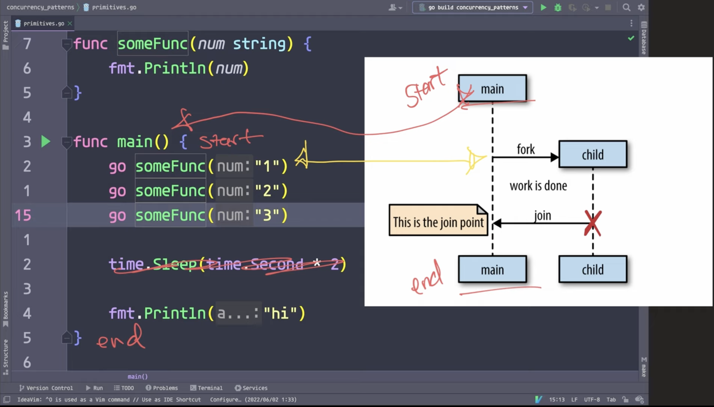
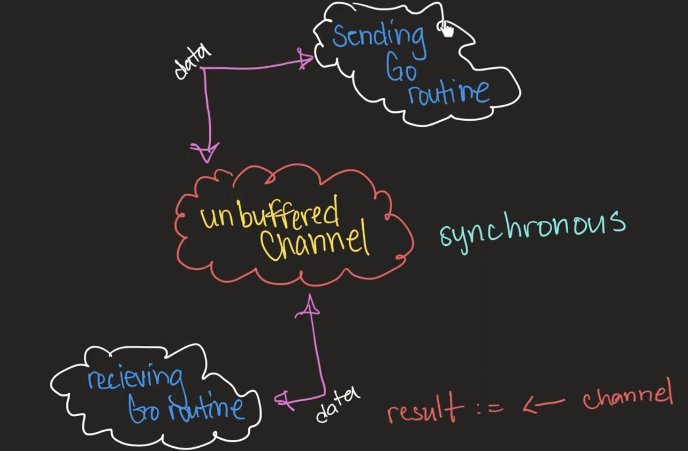
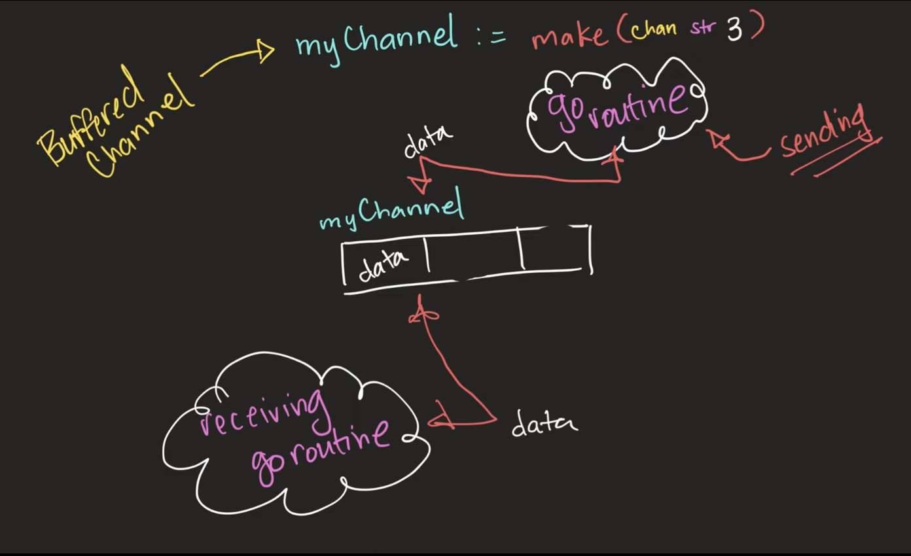
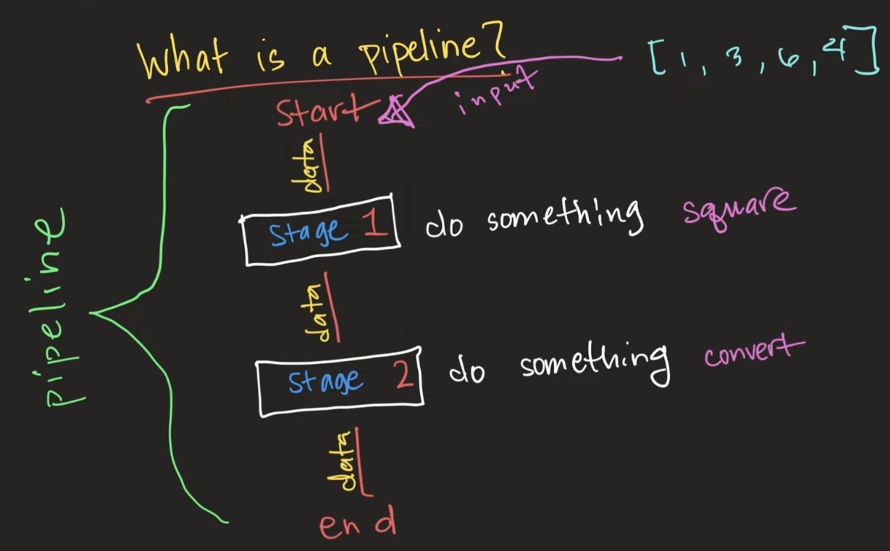
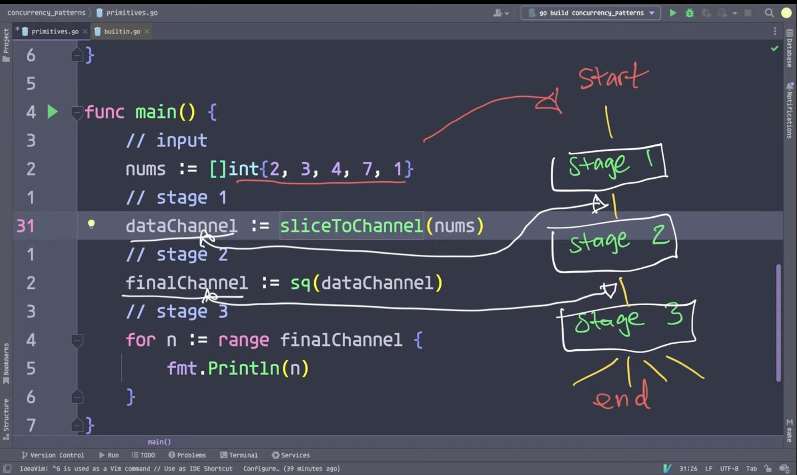
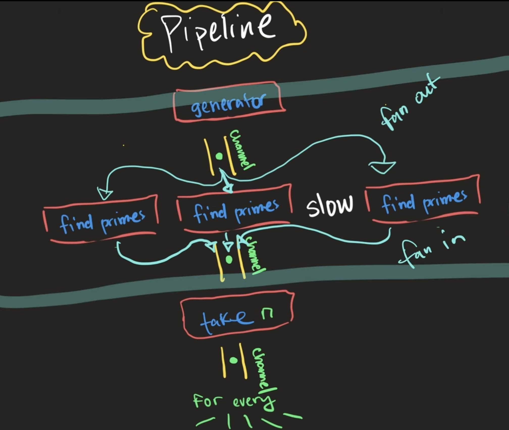
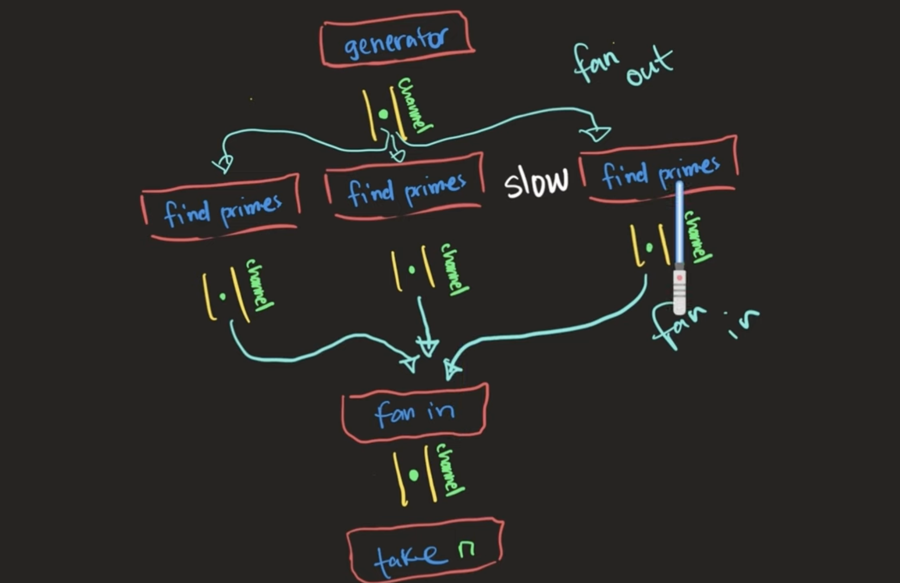

# Content

- [GoRoutines](#goroutines)
  - [Fork-Join Model](#fork-join-model)
- [Channels](#channels)
- [Select](#select)
- [Buffered vs Unbuffered Channel](#buffered-vs-unbuffered-channel)
- [Go Concurrency Patterns](#go-concurrency-patterns)
  - [for-select loop](#for-select-loop)
  - [done channel](#done-channel)
  - [Pipelines](#pipelines)
  - [Generator](#generator)
  - [Combining Pipelines and Generator](#combining-pipelines-and-generator)

# GoRoutines

```go
func someFunc(num string) {
	fmt.Println(num)
}

func main() {
    // 3 GoRoutines
	go someFunc("1")
	go someFunc("2")
	go someFunc("3")

    // time.Sleep is not a `join` of child processes to main process
	time.Sleep(time.Second * 2)

	fmt.Println("Hi")
}
```

## Fork-Join model



- `Fork-Join` Model in Go
  - We are responsible for implementing the re-join of child process to main process.

# Channels

- Used to communicate information between GoRoutines.
- Channels are FIFO queues.

```go
func main() {
	// main goroutine and our created goroutine communicate via this channel
	myChannel := make(chan string)

	go func() {
		myChannel <- "data"
	}()

	// main func is reading data from channel because
	// main is also a goroutine
	// main func waits either for channel to close or when it has received data from channel
	// this is a blocking line of code, it's where child goroutine re-joins with main goroutine
	// "join point"
	msg := <-myChannel

	fmt.Println(msg)
}
```

# Select

- Allows a goroutine to wait on multiple communication operations.
- If `select` receives messages from multiple channels at the same time, it will choose one message at random.

```go
func main() {
	myChannel := make(chan string)
	anotherChannel := make(chan string)

	go func() {
		myChannel <- "data"
	}()

	go func() {
		anotherChannel <- "cow"
	}()

	select {
	case msgFromMyChannel := <-myChannel:
		fmt.Println(msgFromMyChannel)
	case msgFromAnotherChannel := <-anotherChannel:
		fmt.Println(msgFromAnotherChannel)
	}
}
```

# Buffered vs Unbuffered channel



- Unbuffered Channel
  - **Synchronous** communication between goroutines. send and receive takes places at the instant.
  - E.g., When goroutine A sends data to unbuffered channel, it will be blocked until data is received from the unbuffered channel. Thus, goroutines communicate synchronously where the sender has to await the response from the receiver.



- Buffered Channel
  - **Asynchronous** communication between goroutines.
  - Uses queue-like functionality, send data to channel and forget about it up to the allowed capacity.
  - Goroutine is not blocked if it managed to send data to the queue, i.e., the max capacity has not been reached.
  - If the channel is full, the sending goroutine will be blocked until data is read from the channel.

# Go Concurrency Patterns

## `for-select` loop

- Using `select` for each iteration in a `for` loop.

```go
func main() {
	// Buffered channel with limited capacity of 3
	charChannel := make(chan string, 3)
	chars := []string{"a", "b", "c"}

	for _, s := range chars {
		select {
		case charChannel <- s:
		}
	}

	close(charChannel)

	for result := range charChannel {
		fmt.Println(result)
	}
}
```

## `done` channel

```go
// Pass to func argument as read-only channel
// `<-chan` means it's a read-only channel, cannot write data into the channel
func doWork(done <-chan bool) {
	for {
		select {
		case <-done:
			return
		default:
			fmt.Println("DOING WORK")
		}
	}
}

func main() {
	// Running a goroutine that runs indefinitely
	// until parent goroutine tells it to stop

	// Goroutine leak: runs for the lifetime of the application
	// running in the background and consuming memory, processing power and resources
	// Avoid this! Use `done` channel where parent goroutine cancels this.

	done := make(chan bool)

	go doWork(done)

	time.Sleep(time.Second * 3)

	close(done)
}
```

## Pipelines



- Have multiple stages in the pipeline and each performs a specific operation on the input.
- This allows a separation of concerns between the stages.



## Generator

- Put a stream of data into a channel.

```go
func repeatFunc[T any, K any](done <-chan K, fn func() T) <-chan T {
	stream := make(chan T)
	go func() {
		defer close(stream)
		for {
			select {
			case <-done:
				return
			case stream <- fn():
			}
		}
	}()

	return stream
}

func main() {
	done := make(chan int)
	defer close(done)

	randomNumFetcher := func() int {
		// function that returns a random integer no greater than 500M
		return rand.Intn(500000000)
	}

	for random := range repeatFunc(done, randomNumFetcher) {
		fmt.Println(random)
	}
}
```

## Combining Pipelines and Generator



- `findPrimes` is a slow operation.
  - Scale up by fanning out. Increase the number of go routines
  - Once done, fan in the goroutines into 1 channel.


