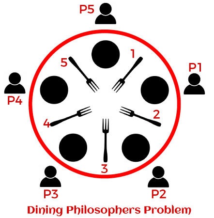

# The Dining Philosophers

- 5 philosophers live in a house together, and they always dine together at the same table, sitting in the same place.
- They always eat a special kind of spaghetti which requires 2 forks.
- There are 2 forks next to each plate, which means that no 2 neighbors can be eating at the same time.
- **Problem Statement**: How do you write a program that ensures that no philosopher will starve?