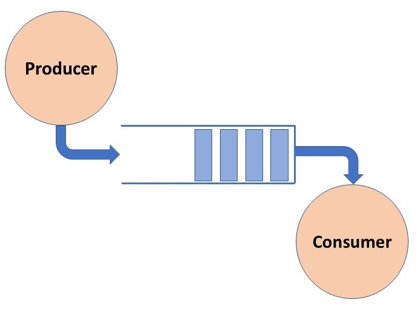

# The Producer-Consumer problem

- Synchronization problem in concurrent programming.
- It involves 2 types of processes, namely producers and consumers, which share a common **fixed-size buffer** or **queue** as a resource.
- The problem is to ensure that the producers do not produce items into the buffer it it's full, and consumers do not consume items form the buffer it it's empty.
- The goal is to achieve synchronization to prevent issues like data corruption, deadlocks, or race conditions.

## Context of Pizzeria

1. **Producers (Chefs):** They produce pizzas and place them on a counter.
2. **Consumers (Customers):** They pick up pizzas from the counter and consume them.
3. **Shared Resource (Counter/Queue):** This is the common stage where pizzas are placed. The buffer has a limited capacity.

## Constraints

- The chef (producer) should not produce pizzas if the counter is full.
- The customer (consumer) should not pick up pizzas if the counter is empty.
- There should be a mechanism for communication and synchronization between the producer and consumer to avoid conflicts and ensure that the system works correctly.
- The implementation typically involves the use of synchronization primitives like semaphores, mutexes, or other mechanism to control access to the shared resource and ensure that producers and consumers do not interfere with each other in a way that could lead to data corruption or other issues.