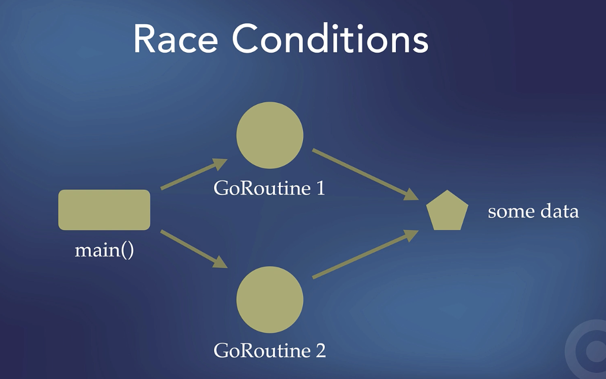

# Concurrency in Go

- Add the word `go` before the function to make it run concurrently.
- Don't always just lock functions, instead we can make use of go channels to pass data around between the GoRoutines.

# Section 1: GoRoutines, `go` keyword, and WaitGroup

- Running things in the background, or concurrently.
- Can have multiple GoRoutines at the same time.
- GoRoutines are very lightweight threads and they run quickly. A group of GoRoutines is managed by the Go Scheduler which decides what go routines runs and how much execution time it get, etc.. in the background.
- The `main` function itself is a GoRoutine

```go
package main

func main() {
    fmt.Println("Hello World!")
}
```

## `main` goroutine execution

- In the example below, the `main` goroutine is not waiting for the other goroutine to finish before it exits.
- When the `main` function finishes, the program exists, and any remaining goroutines are terminated. This is likely happening before the goroutine scheduled with `go printSomething("This is the first thing to be printed!")` gets a chance to execute.
- Can use `sync.WaitGroup` to solve the issue.

```go
func printSomething(s string) {
	fmt.Println(s)
}

func main() {
	go printSomething("This is the first thing to be printed!")
	printSomething("This is the second thing to be printed!")
}

// Output:
This is the second thing to be printed!
```

## `WaitGroup`

- `WaitGroup` is a synchronization primitive in Go used to wait for a collection of goroutines to finish their execution before proceeding further.
- If the `Done` method is called more times than the `Add` method, resulting in a negative counter, it will lead to a runtime panic.

# Section 2: Race Conditions, Mutexes and an Introduction to Channels

## `sync.Mutex`

- Mutex = "mutual exclusion" allows us to deal with race conditions
- Dealing with shared resources and concurrent/parallel goroutines
- When multiple goroutines **access shared data concurrently**, synchronization is crucial to prevent race conditions. Ensures _data integrity_ in the concurrent program.
- Lock/Unlock. `sync.Mutex` provides a mutual exclusion lock.
  - `mutex.Lock()` is used to acquire the lock and ensure exclusive access to the critical section.
  - `mutex.Unlock()` is used to release the lock after the critical section is executed.
    - A critical section is a part of the program the access shared resources and must be executed atomically.
- In the example code below, we added mutex with locks on the shared data in multiple goroutines to ensure data integrity.

```go
func updateMessage(s string, m *sync.Mutex) {
	defer wg.Done()

	m.Lock()
	msg = s
	m.Unlock()
}
```

## Race Conditions



- Race conditions occur when multiple GoRoutines try to access the same data.
- Can be difficult to spot when reading code.
- Go allows us to check for them when running a program, of when testing our code with go test.
- In the example code below, we run into a race condition where 2 go routines are trying to update `msg` variable that is a shared resource. Run `go run -race .` to see the race condition.

```go
func updateMessage(s string) {
	defer wg.Done()
	msg = s
}

func main() {
	msg = "Hello World!"

	wg.Add(2)
	go updateMessage("Hello, universe!")
	go updateMessage("Hello, cosmos!")
	wg.Wait()

	fmt.Println(msg)
}
```

## Channels

- Channels are a means of having GoRoutines share data.
- Can talk to each other.
- Go's philosophy: having things share memory by communicating, rather than communicating by sharing memory.
- The Producer/Consumer problem.

## Testing Race Conditions in Go

- Use `go run -race .` to check if there are any race conditions
- Use `go test -race .` for testing race conditions.

## The Producer-Consumer problem

- [Link](https://www.educative.io/answers/what-is-the-producer-consumer-problem)
- [Wikipedia](https://en.wikipedia.org/wiki/Producer%E2%80%93consumer_problem)
