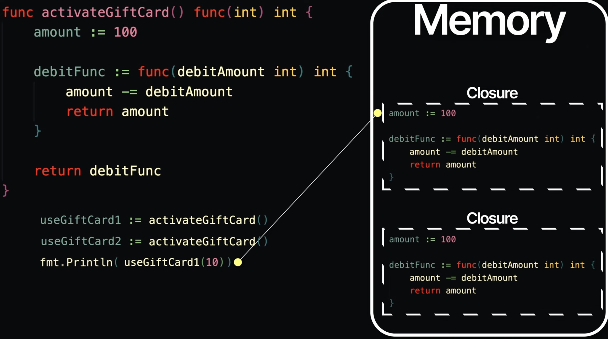

# Content

# Closures

- A **closure** is a function **defined inside another function** that can access and modify variables from the outer function's scope, even after the outer function has returned.
- Closures retain **references**, not copies, of variables.

